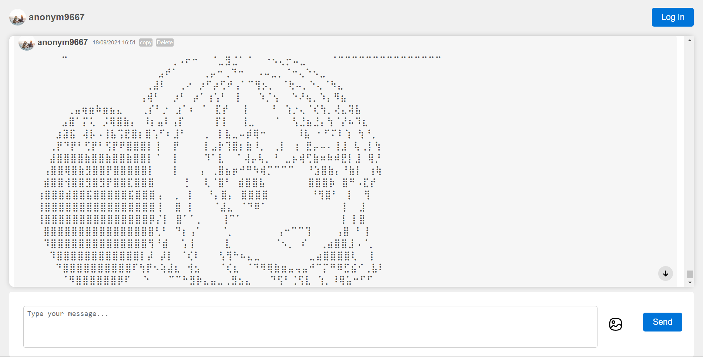

# what is this?

this is an app that runs on pure PHP without any native framework. the main purpuse of this app basicly is just from my a struck of idea. the app itself just my old project i uploaded bcs its unfortunate if got rotten in my folder so i up it on here. all the html, css, and php is from my idea itself, with a little bit of help from an old friend chatgpt for the php and also the logic i made it myself, i can make this app.

## App Screenshot



this is main page after you accept the cookie website and chat anonymusly.

## quick explanation of the app

this app is running using pure PHP code and mysql database and a synchronous AJAX to retrive the message from database to the app. *this app created is just under 3 and a half days so its quite buggy*

## how to download

actually its quite simple if you already knows what ur doing but if not, first you download PHP then clone this repo to your directory

```
git clone https://github.com/ripaaf/chatglobal.git
```

or you can download the project file on [here.](https://github.com/ripaaf/chatglobal/archive/refs/heads/main.zip)

### database

the database itself you can see and download in [here](https://github.com/ripaaf/chatglobal/blob/main/globalchat.sql) you can import the database by using `mysql -u username -p globalchat < globalchat.sql` then you all set!

*for a quick run for the app you can type in the folder

```
php -S localhost:1000
```

then you can open the app in **localhost:1000**

## Profile page

the profile page itself is not good, its bad but it works as intented, and there is another file for profile if you already login not anonym you can change your name and profile in that page.
